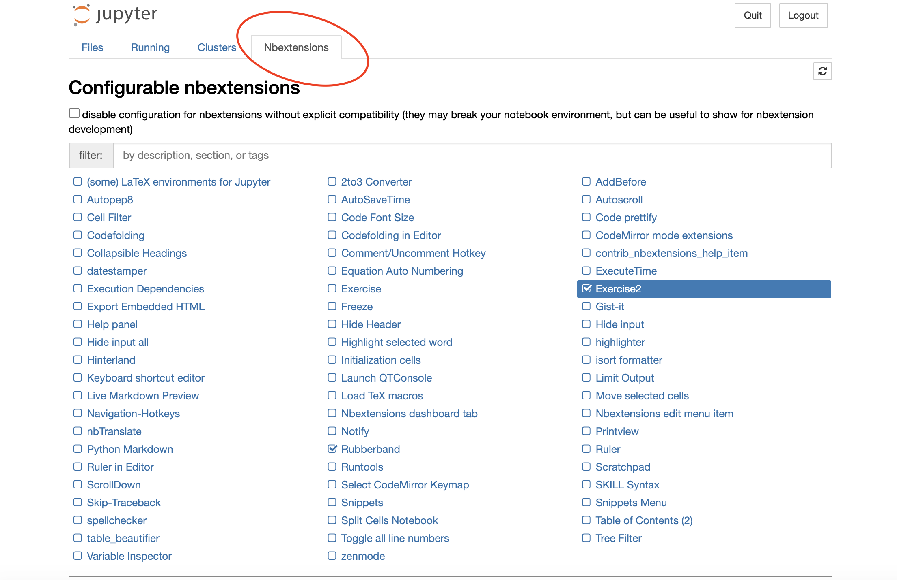

# code-camp-env

This repo is designed to provide an environment to support Code Camp running through MyBinder.org; since Binder uses the SHA hash to determine when it needs to rebuild the docker image, if we separate the env from the actual notebooks this allows us to update the notebooks without the environment being rebuilt. 

The driver for this approach was wanting to use some form of 'Q&A' with Code Camp where the 'A' was hidden from the student unless they chose to reveal it. There are two `nbextensions` options (`exercise` and `exercise2`) and one `labextension` option ([jupyterlab-solutions](https://github.com/rmotr/jupyterlab-solutions)). The JupyterLab extension appears to have been abandonned, so although I could get it to install (and even successfully enabled) I couldn't get the button to show up in the toolbar. 

With this in mind, I've opted for `exercise2` because it makes the 'Answer' part more obvious... though it might tempt students to click on it without trying to figure it out for themselves.

So you can now: 
- [Launch the Jupyter Notebook server via Binder](https://mybinder.org/v2/gh/kingsgeocomp/code-camp-env/master?urlpath=git-pull%3Frepo%3Dhttps%253A%252F%252Fgithub.com%252Fkingsgeocomp%252Fcode-camp%26urlpath%3Dtree%252Fcode-camp%252F%26branch%3Dmaster) 
- You can also [launch individual notebooks directly](https://mybinder.org/v2/gh/kingsgeocomp/code-camp-env/master?urlpath=git-pull%3Frepo%3Dhttps%253A%252F%252Fgithub.com%252Fkingsgeocomp%252Fcode-camp%26urlpath%3Dtree%252Fcode-camp%252Fnotebook-04-errors-and-debugging.ipynb%26branch%3Dmaster)
- And note too that you can force _either_ repository (Environment or Content) to use a specific branch so that you can continue development in one repository without impacting the other; for instance, [this link is tied to branch notebook-v1.0](https://mybinder.org/v2/gh/kingsgeocomp/code-camp-env/notebook-v1.0?urlpath=git-pull%3Frepo%3Dhttps%253A%252F%252Fgithub.com%252Fkingsgeocomp%252Fcode-camp%26urlpath%3Dtree%252Fcode-camp%252F%26branch%3Dmaster) of the Environment Repository, while [this link would use the gds-revamp branch of the content repo and the notebook-v1.0 of the environment repo](https://mybinder.org/v2/gh/kingsgeocomp/code-camp-env/notebook-v1.0?urlpath=git-pull%3Frepo%3Dhttps%253A%252F%252Fgithub.com%252Fkingsgeocomp%252Fcode-camp%26urlpath%3Dtree%252Fcode-camp%252F%26branch%3Dgds-revamp)

So changes to `code-camp` notebooks are still made in that repository, but the Binder environment is never rebuilt unless there is a change to [requirements.txt](requirements.txt) or [postBuild](postBuild). The requirements and postBuild files install `nbgitpuller` so that the latest (or tagged, if you set this up accordingly) version is always pulled from GitHub.

So to make changes to any of the notebooks in Code Camp (e.g. to get the Q&A format set up in each notebook) you would:

- `docker pull jreades/cc:v0.4` ([or whatever the most recent version is](https://hub.docker.com/repository/docker/jreades/cc))
- `cd /path/to/code-camp-repo/`
- `docker run --rm -ti -p 8888:8888 --mount type=bind,source="$(pwd)",target=/home/jovyan/ jreades/cc:v0.4` An alternative (which _might_ work better on Windows) is: `docker run --rm -ti -p 8888:8888 -v $(pwd):/home/jovyan/ jreades/cc:v0.4`
- Enable the `exercise2` extension in the settings, but to do this you will likely first need to uncheck `disable configuration for nbextensions without explicit compatibility` (see picture below).

You then set up the questions and answers in each notebook and just commit the updated notebook back into the code-camp repo.

To generate a new MyBinder link to launch a specific notebook you can go to: [jupyterhub.github.io/nbgitpuller/link](https://jupyterhub.github.io/nbgitpuller/link). The steps are then:

1. Click on 'Binder' tab on right-hand side (you start in the JupyterHub tab by default which isn't what you want)
2. Change Git Environment Repository URL to, e.g.: [https://github.com/kingsgeocomp/code-camp-env](https://github.com/kingsgeocomp/code-camp-env) and set branch as needed (hint: shouldn't be needed)
3. Change Git Content Repository URL to: [https://github.com/kingsgeocomp/code-camp](https://github.com/kingsgeocomp/code-camp) and set branch as needed (hint: may be useful)
4. Set 'File to open' as appropriate (e.g. `notebook-04-errors-and-debugging.ipynb`).
5. Make sure (for Code Camp at least for the time being) that 'Classic Jupyter Notebook' is selected since the JupyterLab extension doesn't work..

Doesn't look like much now I've figured it out, but there you go.

Jon

Refs for posterity:

- [Separate content and environment repositories](https://discourse.jupyter.org/t/tip-speed-up-binder-launches-by-pulling-github-content-in-a-binder-link-with-nbgitpuller/922)
- [Other guidance on speeding up Binder launches](https://discourse.jupyter.org/t/how-to-reduce-mybinder-org-repository-startup-time/4956)

